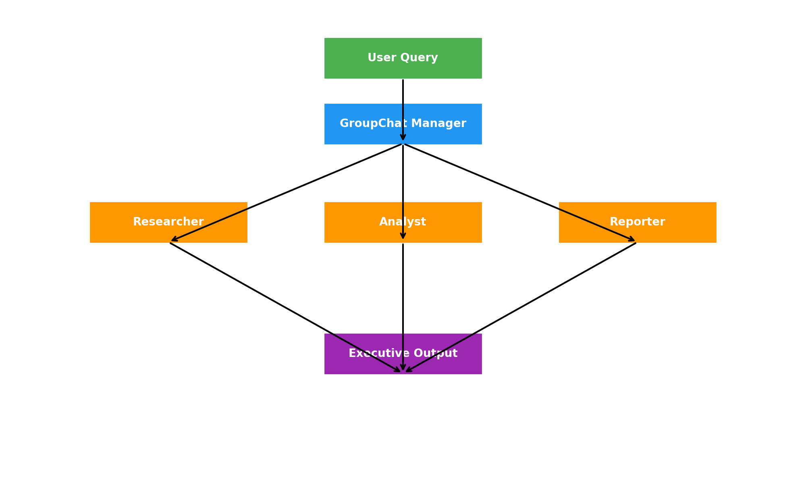
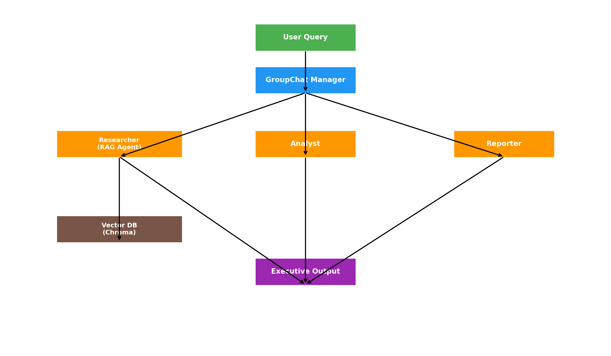

# 🤖 Multi-Agent AI Portfolio (AutoGen + RAG + Evaluation)

This repo demonstrates my hands-on work with **Agentic AI** using the [AutoGen framework](https://github.com/microsoft/autogen), **Ollama** for local LLMs, and **ChromaDB** for retrieval-augmented generation (RAG).

It’s designed as a **technical portfolio** to showcase experience with:
- Multi-agent orchestration
- Retrieval pipelines (RAG)
- Evaluation frameworks for AI outputs

---

## 📂 Project Structure

```
multi-agent-autogen/
├─ main.py                # Core 3-agent demo (Researcher → Analyst → Reporter)
├─ rag.py                 # RAG pipeline with ChromaDB + PDFs
├─ eval/
│  ├─ evaluate.py         # Evaluation harness for automated scoring
│  └─ results/
│     └─ eval_results.json
├─ data/
│  └─ AI-Playbook.pdf     # Example knowledge base (replace with your own docs)
├─ assets/
│  ├─ autogen-architecture.txt
└─ requirements.txt
```

---

## 🚀 Quickstart

### 1. Clone the Repo
```bash
git clone https://github.com/baljindersingh/multi-agent-autogen.git
cd multi-agent-autogen
```

### 2. Create Virtual Environment
```bash
python -m venv .venv
source .venv/bin/activate   # Mac/Linux
.venv\Scripts\activate      # Windows
```

### 3. Install Dependencies
```bash
pip install -r requirements.txt
```

### 4. Install & Run Ollama (LLM backend)
1. [Download Ollama](https://ollama.ai/download)  
2. Pull a model (e.g. Phi-3):  
   ```bash
   ollama pull phi3
   ollama serve
   ```  

### 5. Prepare Knowledge Base (ChromaDB)
For the **RAG pipeline (`rag.py`)**:  
1. Place a PDF inside the `data/` folder (e.g. `data/AI-Playbook.pdf`).  
2. On first run, embeddings will be created and persisted in `chroma_db/`.  
3. On subsequent runs, ChromaDB reloads instantly.  
4. To reset, delete the folder:  
   ```bash
   rm -rf chroma_db/
   ```

### 6. Run Demos
- **Multi-Agent Collaboration**  
   ```bash
   python main.py
   ```  

- **RAG (Retrieval-Augmented Generation)**  
   ```bash
   python rag.py
   ```  

- **Evaluation Harness**  
   ```bash
   python eval/evaluate.py
   ```  

### 7. Example Output
```
🔎 Running RAG multi-agent chat for query: Summarize the Microsoft AI Partner Playbook into 3 steps.

Researcher → Context retrieved...
Analyst → Extracted themes...
Reporter → 1) Align with AI Business Solutions 
           2) Accelerate Copilot adoption 
           3) Secure AI productivity
```

---

## 📊 Project Highlights

- **Multi-Agent Orchestration**  
  Researcher, Analyst, and Reporter agents collaborate via AutoGen’s `GroupChatManager`.

- **Retrieval-Augmented Generation (RAG)**  
  Uses **ChromaDB + HuggingFace embeddings** to ground responses in real documents.  

- **Evaluation Harness**  
  Lightweight scoring framework (`eval/evaluate.py`) to check outputs for coverage and quality.  

- **Microsoft AI Alignment**  
  Mirrors how Copilot Agents + Azure AI Foundry orchestrate knowledge workflows:  
  - **Researcher** → Azure AI Search / RAG pipeline  
  - **Analyst** → Business logic layer in Copilot  
  - **Reporter** → Executive output via M365 Copilot  

---

## 📷 Architecture

### Multi-Agent Flow


### Multi-Agent + RAG


---

## 🛠️ Requirements

See [requirements.txt](requirements.txt):  
- `pyautogen` (multi-agent framework)  
- `chromadb` (local vector store)  
- `langchain-community` (PDF + embeddings)  
- `sentence-transformers` (text embeddings)  
- `pypdf` (document parsing)  

---

## 🔮 Future Enhancements
- Add **Copilot Studio manifest** for integration with M365 Copilot as a custom action.  
- Swap Ollama → **Azure AI Foundry models** for enterprise deployment.  
- Extend evaluation using **Azure AI Evaluation SDK** (faithfulness, groundedness).  

---

## 📬 Contact
If you’d like to learn more about this project or how it ties into Microsoft’s **AI Business Solutions**, feel free to connect on [LinkedIn](https://linkedin.com/in/baljindersingh).  
